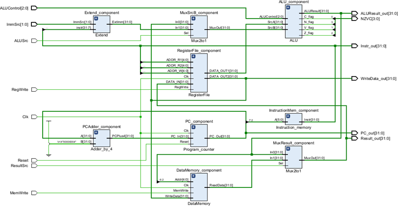
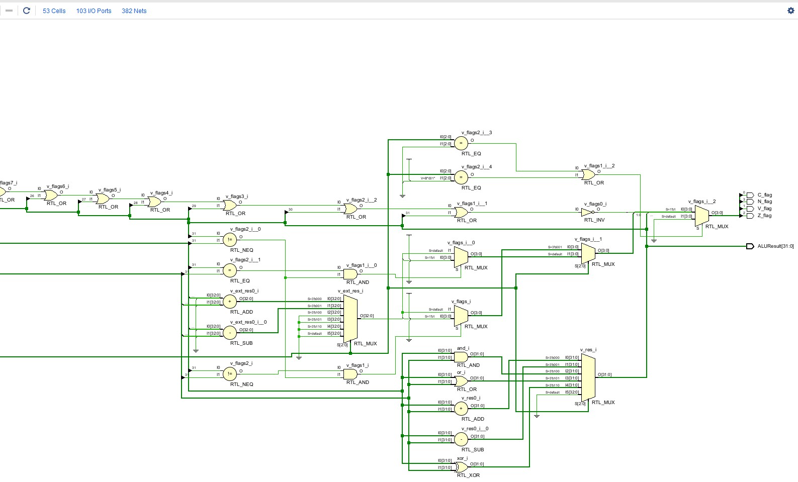
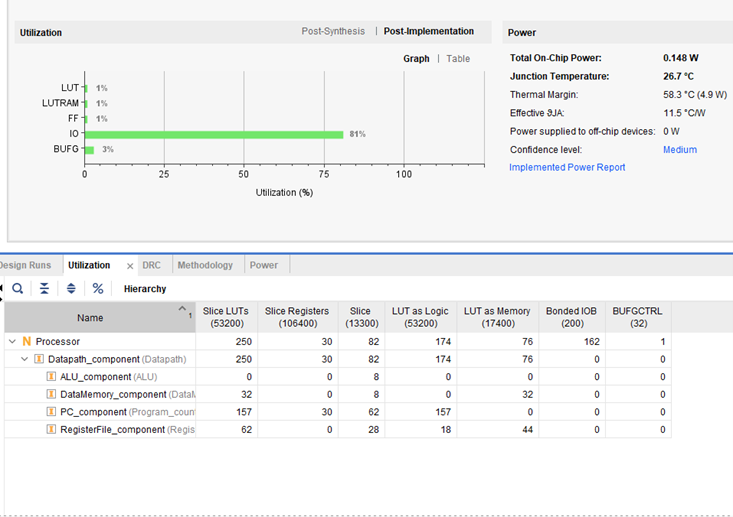
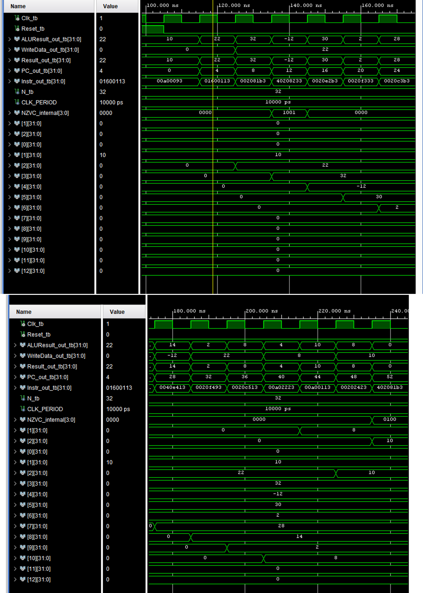
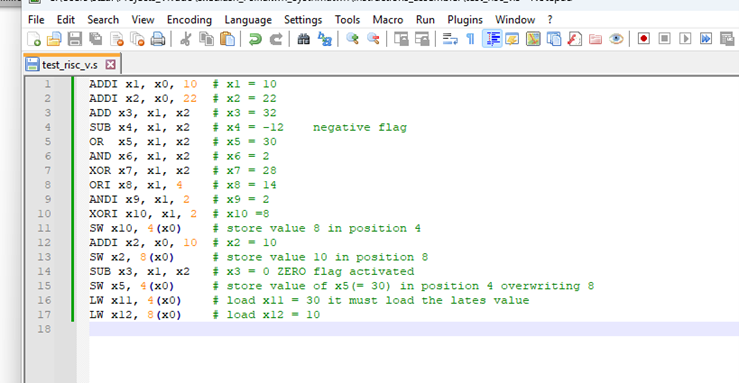
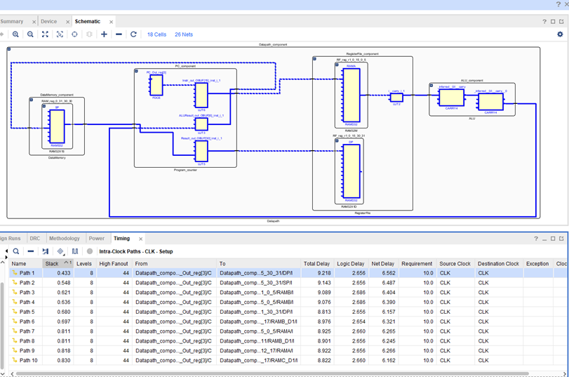

# 🚀 RISC-V Single-Cycle Processor (RV32I)

## 📌 Project Overview
This project involves the design, implementation, and hardware verification of a **32-bit Single-Cycle RISC-V Processor** using **VHDL**. The architecture is based on a specific subset of the **RV32I** instruction set. The entire system, including the Datapath and the Control Unit, was developed hierarchically and verified through rigorous behavioral and post-implementation timing simulations in **Xilinx Vivado**.

The design follows the "Single-Cycle" philosophy, where every instruction (fetch, decode, execute, and write-back) is completed within a single clock cycle.

*This project was implemented as a part of the Digital Systems Design course at the National and Kapodistrian University of Athens.*

---

## 🏗️ Architecture & Datapath
The processor is composed of several high-level modules integrated into a top-level entity. Below is the Top-Level RTL Schematic generated by Vivado:

### 1. Datapath Components
* **Program Counter (PC):** A 32-bit register holding the current instruction address. Optimized to 30 bits as the 2 LSBs are always zero due to word alignment.
* **Instruction Memory:** Implemented as a ROM module containing the machine code.
* **Register File (RF):** Features 32 general-purpose registers (x0-x31) with asynchronous dual-read ports and a synchronous write port. Register x0 is hardwired to zero.
* **ALU (Arithmetic Logic Unit):** The core execution unit supporting arithmetic/logic ops and status flags: Negative (`N`), Zero (`Z`), Overflow (`V`), and Carry (`C`). 
  
  *ALU Internal Gate-Level Logic:*
  

* **Data Memory (RAM):** Distributed RAM used for data storage during Load/Store operations.

### 2. Control Unit
The Control Unit acts as the "brain" of the processor, decoding opcodes and function fields to generate control signals:
* **Main Decoder:** Produces signals like `RegWrite`, `ALUSrc`, `MemWrite`, and `ResultSrc`.
* **ALU Decoder:** Determines the specific operation for the ALU based on `funct3` and `funct7`.

---

## 🛠️ Supported Instruction Set
The processor handles the following core RV32I instructions:
* **Memory Access:** `LW` (Load Word), `SW` (Store Word).
* **R-Type (Arithmetic/Logic):** `ADD`, `SUB`, `OR`, `XOR`.
* **I-Type (Immediate Operations):** `ADDI`, `ANDI`, `ORI`, `XORI`.

---

## 📊 Hardware Performance & Metrics
Based on post-implementation synthesis reports:

| Metric | Value |
| :--- | :--- |
| **Max Operating Frequency** | **104.535 MHz** |
| **Minimum Clock Period** | **9.567 ns** |
| **Slice LUTs** | **250** (174 as Logic, 76 as LUTRAM) |
| **Registers (Flip-Flops)** | **30** (Optimized PC storage) |
| **Total On-Chip Power** | **0.148 W** |

---

## 🔍 Verification & Testing

### 1. Functional Simulation
A comprehensive assembly test program was executed to verify every supported instruction, ensuring correct data flow between registers/memory and proper flag activation (e.g., Zero flag for `SUB` results).

The instructions that have been saved to Processor Memory (ROM) are as follows:

### 2. Timing Analysis
Post-implementation timing simulations were conducted to identify the **Critical Path**.
* **Worst Negative Slack (WNS):** 0.433 ns.
* **Critical Path:** Identified as the route from the PC register to the Write-Back stage through Instruction Memory and the ALU.

---

## 📂 Repository Structure
* `src/`: VHDL source files for all modules.
* `testbench/`: Testbenches for component-level and top-level verification.
* `reports/`: Technical project reports and documentation.
* `programs/`: Assembly code and machine code binaries.
* `assets/`: RTL Schematics and Waveform screenshots.

## 📄 Documentation
Detailed technical documentation and project specifications can be found in the `reports/` folder. 

* **[Comprehensive Project Report (Greek)](reports/greek/RISC-V_Single_Cycle_report_GREEK.pdf):** A deep-dive analysis of the datapath, control unit, timing diagrams, and hardware metrics.
* **[Comprehensive Project Report (English)](reports/english/RISC-V_Single_Cycle_report_ENGLISH.pdf):** An English version of the detailed project report accessibility.

* **[Project Specifications Summary (Greek)](reports/greek/Project_Specifications_GREEK.pdf):** A prototype detailed description of the core architectural requirements and constraints in Greek.

* **[Project Specifications Summary (English)](reports/english/Project_Specifications_ENGLISH.pdf):** A brief, translated summary of the core architectural requirements and constraints.